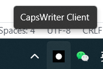
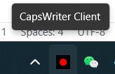

## CapsWriter-Offline


See [original readme](https://github.com/HaujetZhao/CapsWriter-Offline) to learn more details.

本Fork做了如下改动：

### Client

托盘化管理并带状态管理，消除了原有弹出的控制台程序。
目前输出被重定向到二进制文件所在文件夹下的`debug_log.txt`和`error_log.txt`, 如果不按预期工作可以先检查日志。例如当麦克风不可用的时候，该程序直接报错，封装托盘尚未自动重启。

限制：

- 移除了拖入语音转文字的功能
- 移除了长按caps进入语音转文字模式
- 键盘按键输入拦截不太稳定

#### 关闭状态



#### 打开状态



### Server

server端添加了docker支持，可以让server在docker内运行。
我已上传dockerhub镜像，内包含所有模型(4.6GB)，可以开箱即用。但推荐自行打包，因为这个实在太大了:(

```shell
# it is 4.46GB so it may take time to download
# todo: tidy up docker image to make it small.
docker pull xieyuschen/capswriter:v1.0.0
```

也可以clone本仓库后自己build，models放在镜像里或者mount到models目录均可。

```
export GIT_TAG=v1.0.0 # add your own tag if you want
docker build -t xieyuschen/capswriter:$GIT_TAG .
```